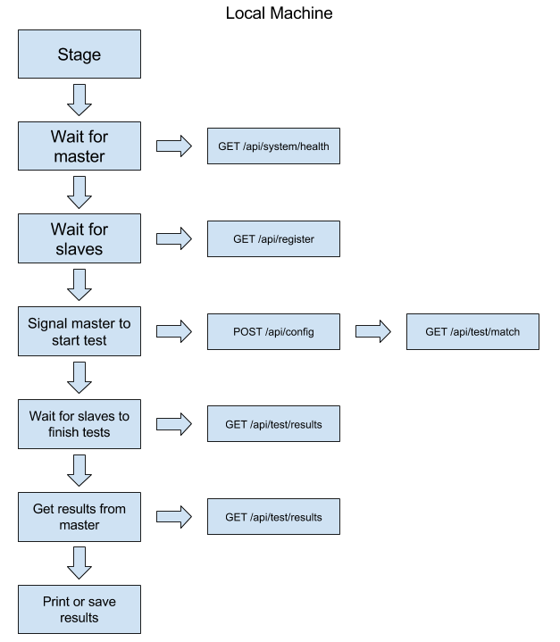
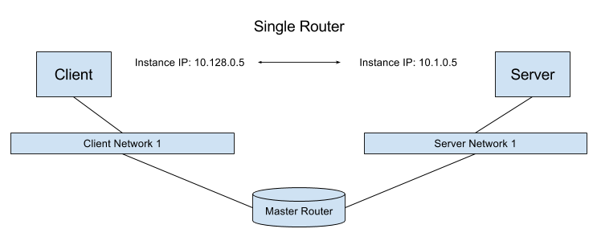
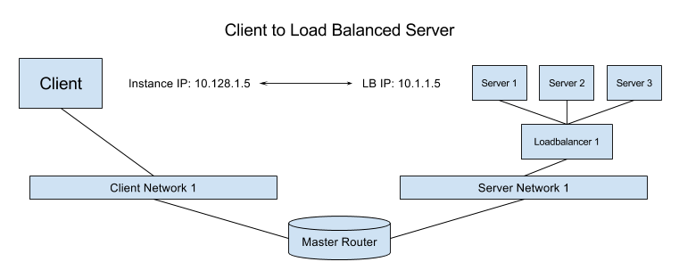

# CloudPunch

Framework for performance testing an OpenStack environment at scale

## Features

- **Written 100% in Python** - CloudPunch is written in the Python language including the sections that stage OpenStack and the tests that run. This was chosen to avoid reliance on other tools.

- **Create custom tests** - Because tests are written in Python, custom written tests can be ran by simply dropping a file in a folder. These tests are not limited; a test can do anything Python can do.

- **Fully scalable** - A test can include one instance or hundreds. A couple lines of configuration can drastically change the stress put on OpenStack hardware.

- **Test across OpenStack environments** - Have multiple OpenStack environments or regions? Run tests across them to see performance metrics when they interact.

- **Run tests in an order or all at once** - See single metric results such as network throughput or see how a high network throughput can affect network latency.

- **JSON and YAML support** - Use a mix of JSON or YAML for both configuration and results

## Process Breakdown

CloudPunch consists of three different roles:

 - Local Machine - The machine starting the test(s) and receiving the results outside of OpenStack.

 - Master - The OpenStack instance that is the communication between external and internal OpenStack. The local machine will send configuration to the master so the slaves can get it. The slaves send test(s) results back the master so the local machine can receive them.

 - Slave - The OpenStack instance that runs the test(s). It reports only to the master.

##### Local Machine

The local machine handles staging everything on OpenStack. It also handles cleanup when completed. Below is an overview of the process that the local machine handles. API calls to the master are included on the right side.

##### Master

The master is just a flask instance hosting a web API. The master is the gateway between external and internal OpenStack. The local machine and slaves only talk to the master, never to each other.

##### Slave

Slaves are the instances that run the test(s). They talk to the master to get the configuration, run the test(s), and then send the JSON results back the master. Below is an overview of the process that the slaves handle. API calls to the master are included on the right side.

## Network Types

There are three different network types CloudPunch can setup for testing. The network type is configured with the `network_mode` key.

##### Full Network

Full network uses floating IP addresses to communicate between servers and clients. The path between servers and clients includes 2 networks and 2 routers. This is best for Layer 3 communication testing with the use of floating IP addresses. See below for a diagram showing the topology of full network.

##### Single Router

Single router uses the instance's IP addresses and not floating IP addresses (they are not assigned floating IP addresses) to communicate between servers and clients. The path between servers and clients includes 2 networks and 1 router. This is best for Layer 3 communication testing without the use of floating IP addresses. See below for a diagram showing the topology of single router.

##### Single Network

Single router uses the instance's IP addresses and not floating IP addresses (they are not assigned floating IP addresses) to communicate between servers and clients. The path between servers and clients includes 1 network. This test is best for Layer 2 communication testing. See below for a diagram showing the topology of single network.

## Load Balancer Network

When creation of a load balancer is included in the environment file, a balancer will be created for each network. All instances on this network will be added as members to said load balancer. When full network is used, the load balancers will use floating IP addresses; all other network modes will use fixed IP addresses. See below for a diagram showing a load balancer in front of servers when using the single router network mode.

## Limitations

- No graphical interface

- OpenStack platform support only (no Amazon, Google, etc.)

## Contributing

See [Contributing](../CONTRIBUTING.md)

## License

CloudPunch follows the MIT license. See [License](../LICENSE.md) for more information
